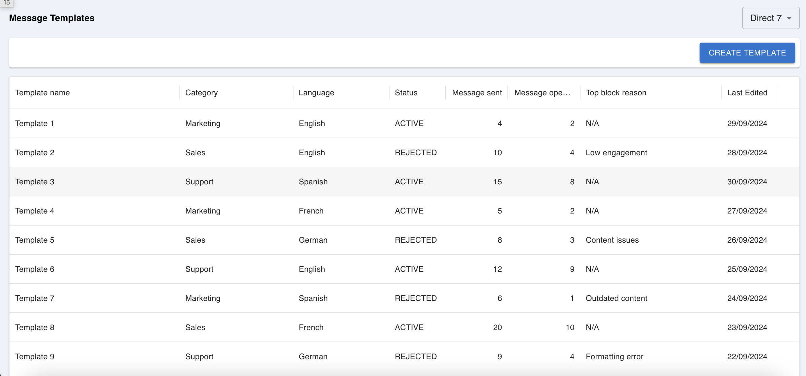
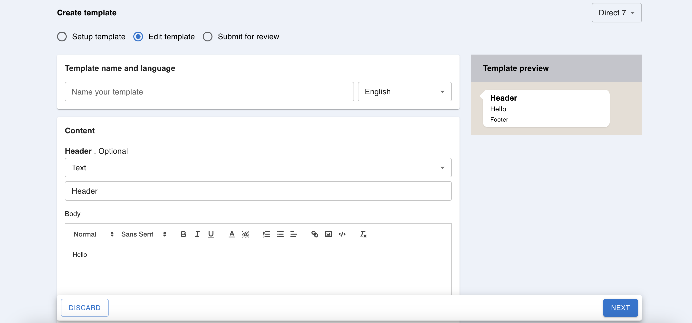

# Message Template

## Table of Contents

- [Prerequisites](#prerequisites)
- [Installation](#installation)
- [Scripts](#scripts)
- [Linting and Formatting](#linting-and-formatting)
- [Usage](#usage)

## Prerequisites

Before getting started, ensure you have the following installed:

- Node.js (v18 or higher) - Required for running the project.
- npm - Package manager used for managing dependencies.

## Installation

To get started with the project, follow these steps:

1. Clone the repository:

   ```bash
   git clone https://github.com/mohammedmurshidkk/message-template.git
   ```

2. Install dependencies (npm install)

## Scripts

Available scripts in the project:

- `dev`: Runs the development server.
- `build`: Builds the production-ready code.
- `preview`: Starts the production server.
- `lint`: Lints the code using built-in linting.
- `format`: Checks the code formatting using Prettier.
- `format:fix`: Formats the code using Prettier and automatically fixes formatting issues.

To run a script, use:

```bash
npm run script-name
```

## Linting and Formatting

This project uses ESLint and Prettier for linting and formatting.

### Linting

Linting helps maintain code quality and consistency by identifying potential errors and enforcing coding standards. To lint your code, run the following command:

```bash
npm run lint

```

## Getting Started

First, run the development server:

```bash
npm run dev
# or
yarn dev
# or
pnpm dev
# or
bun dev
```

## 🖼️ Screenshots

 

